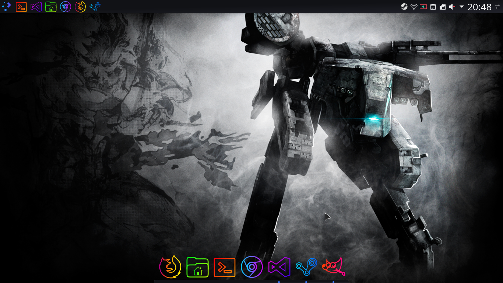

# How I Met Arch Linux

## The purpose of all this

I started installing Arch Linux 2 days ago and I fucked up everything that was possible to fuck up, so I want to document all the good things I did while installing Arch Linux.

These are the guides I used during the process:

[ArchWiki Installation Guide](https://wiki.archlinux.org/index.php/Installation_guide)

[Some random article about disk encryption](https://www.howtoforge.com/tutorial/how-to-install-arch-linux-with-full-disk-encryption/)

[ArchWiki WPA supplicant documentation (for wireless connection)](https://wiki.archlinux.org/index.php/WPA_supplicant)

[]()

## Notes

I install Arch Linux on a notebook so I use wireless connection, so if you (or I) use wired connection, these steps may differ

## Pre-insall stuff

First of all (after making a bootable USB drive with Arch Linux on it and boot up Arch Linux installer) set your keyboard with

```shell
loadkeys hu
```

then set up your wireless connection using WPA supplicant. List your interfaces with 

```shell
ip link
```

and if it list more than one option, you should wildly guess which one to use; I got lo, eno1, wwp0s29u1u6i6 and wlan0 and (miraculously) wlan0 is the one I will use. Write 

```shell
ctrl_interface=/run/wpa_supplicant
update_config=1
```

into /etc/wpa_supplicant/wpa_supplicant.conf with

```shell
echo "ctrl_interface=/run/wpa_supplicant\nupdate_config=1" > /etc/wpa_supplicant/wpa_supplicant.conf
```

and after this you can run

```shell
wpa_supplicant -B -i <interface> -c /etc/wpa_supplicant/wpa_supplicant.conf
```
where -B helps run it in the background and you should write your interface at <interface> like this

```shell
wpa_supplicant -B -i wlan0 -c /etc/wpa_supplicant/wpa_supplicant.conf
```

and if everything is awesome, you can run 

```shell
wpa_cli
``` 

where you can do a bunch of cool shit, like 

```shell
add_network
set_network 0 ssid "MYSSID"
set_network 0 psk "passphrase"
enable_network 0
``` 

and after doing so, you should save your setting and leave wpa_cli with

```shell
save_config
quit
``` 

and run

```shell
dhcpcd
``` 

to start your networking service (I guess). If you made this far, you can run 

```shell
ping archlinux.org
``` 

and hopefully you will get some response. After all this, set your clock with

```shell
timedatectl set-ntp true
``` 
but to be honest, I don't know what it actually does, but it was in the install guide and I'm not taking any chances, so you should run it too.

After all this, fuck up your current file system. Get all the information you with 

```shell
fdisk -l
``` 
but you probably not gonna use it, because if you want to encrypt your disk, you will run

```shell
shred --verbose --random-source=/dev/urandom --iterations=3 /dev/sda
``` 
which takes about 4 hours on a 256GB SSD and it completely fucks up your partitions, which is good, I guess.

When it's ready, run

```shell
cfdisk /dev/sda
``` 
and select dos, create a new partition that takes 100M, make it primary and bootable (this will be the boot partition). Make another partition which can be all the other free space (223.5G), make it primary as well, save (write) your changes and quit.

After making the partitions, encrypt your file system with

```shell
cryptsetup luksFormat --type luks1 --use-random -S 1 -s 512 -h sha512 -i 5000 /dev/sda2
``` 

and it will ask you for an encryption key. When it's done, you should open it with

```shell
cryptsetup open --type luks /dev/sda2 cryptroot
``` 

and format and mount your drives with

```shell
mkfs.ext4 /dev/sda1
mkfs.ext4 /dev/mapper/cryptroot
mount -t ext4 /dev/mapper/cryptroot /mnt
mkdir -p /mnt/boot
mount -t ext4 /dev/sda1 /mnt/boot
``` 

and with all that out of the way, install Arch Linux.

## Installation

Now comes the installation. The packages you install may vary so install these to your likings, but if you want to follow me, run

```shell
pacstrap -i /mnt base linux linux-firmware nano mkinitcpio dhcpcd wpa_supplicant
``` 

and if the installation was successful, generate an fstab (I don't know what it is but every other guide had it, so here it is)

```shell
genfstab -U /mnt >> /mnt/etc/fstab
```

And now go into your system as root with

```shell
arch-chroot /mnt
```

Set timezone with

```shell
ln -sf /usr/share/zoneinfo/Europe/Budapest /etc/localtime
```

even tough it does not seem to work after the desktop environment installation, but take no chances and run it anyway.

Set time with

```shell
hwclock --systohc
```

Generate locale

```shell
locale-gen
echo "LANG=en_US.UTF-8" > /etc/locale.conf
```
And set keymap as well 

```shell
echo "127.0.0.1 localhost" > /etc/hostname
```

Set root password

```shell
passwd
```

Create a user (I think it is needed for a desktop environment) and password to this as well

```shell
useradd -m -g users username
passwd username
```

Modify files to have the encryption as a part of the system startup

```shell
nano /etc/defaults/grub
```

and modify the line GRUB_CMDLINE_LINUX to

```shell
GRUB_CMDLINE_LINUX="cryptdevice=/dev/sda2:cryptroot"
```

and open /etc/mkinitcpio.conf

```shell
nano /etc/mkinitcpio.conf
```

and add the encryptoin to the hook like

```shell
... block encrypt filesystem ...
```

where you should add "encrypt" between "block" and "filesystem".

Create new initramfs with

```shell
mkinitpcio -p linux
```

and install grub

```shell
grub-install --recheck /dev/sda
grub-mkconfig --output /boot/grub/grub.cfg
```

and exit with

```shell
exit
```

Close everything and reboot 

```shell
umount -R /mnt/boot
umount -R /mnt
cryptsetup close cryptroot
systemctl reboot
```
And now you have Arch Linux.

## After-install stuff

So, if everything is according to plan, you reboot your computer and boot Arch Linux from your hard drive (or solid state drive) and you are greeted with a prompt to encrypt your file system. After you've done that, you are expected to log in. I recommend using the root, because you have to install a lot of stuff so you don't need to write sudo all the time.

After logging in, run 

```shell
cd ..
``` 

so if you forget to use / before etc it does not give an error.

Connect to your wireless network using

```shell
ip link
wpa_supplicant -B -i wlp2s0 -c<(wpa_passphrase ssid password)
``` 

and install a desktop environment. I use KDE Plasma with SDDM so if you want to do the same, run

```shell
pacman -S xorg xorg-server plasma sddm konsole
``` 

even tough I'm not sure if I need xorg and xorg-server.

After this, install NetworkManager, by running

```shell
pacman -S networkmanager network-manager-applet
``` 

and after all of this is done, start NetworkManager and SDDM

```shell
systemctl enable NetworkManager
systemctl enable sddm
systemctl start sddm
``` 

(If you have to, you can force stop SDDM with Ctrl+Alt+F2.)

You will be prompted to login with the user you previously created and after that you will be greeted with the vanilla KDE plasma:


At this point probably your user is not a sudoer, so you should modify /etc/sudoers. Open up Konsole and run

```shell
su
```

and login as root, and

```shell
nano /etc/sudoers
``` 

and put your username under root like this:

```shell
root ALL=(ALL) ALL
username ALL=(ALL) ALL
``` 

If NetworkManager is working, connect to your wifi and install the applications you want to use. (I did managed to fuck up this as well so after enabled SDDM I did not have any option to connect to my wifi, so I force stopped it and installed NetworkManager at this point).

If you use touchpad like a noob like me, you shoud do something about it. I followed [this guide](https://wiki.archlinux.org/index.php/Touchpad_Synaptics#Frequently_used_options) to create a file under /etc/X11/xorg.conf.d/70-synaptics.conf and according to a [this reddit post](https://www.reddit.com/r/archlinux/comments/4qd5f7/taptoclick_no_longer_enabled_in_sddm/) I panicked and copied it under /etc/X11/xorg.conf.d/50-synaptics.conf and I also installed xf86-input-synaptics and after a restart it worked, so I don't know which one should you use.

The list of apps I installed:

- chromium
- firefox
- code (visual studio code)
- git
- dolphin (file manager)
- gimp
- steam (needs multilib enabled)

You can [enable multilib this way](https://wiki.archlinux.org/index.php/Official_repositories#multilib)

And this is how it looks after some rice:



Theme: Carl

Icons: OieIcons

Cursor: Bibata Oil

Dock: Latte
